# Soft Skills Evaluation App

A Unity-based gamified DISC assessment tool designed for House & Marine Finland Oy to enhance the recruitment process by evaluating candidates' soft skills effectively.

## Project Purpose

This app was developed as part of a final thesis project to provide House & Marine Finland Oy with a digital tool that supports recruitment by identifying candidates' behavioral traits through DISC analysis. It aims to reduce subjective judgment and introduce structured, data-driven evaluation for better hiring decisions.

## Key Features

- Role-based access: Candidate or Manager
- Candidate registration with input validation
- Gamified DISC questionnaire (4 categories, 25 statements each)
- Local JSON data storage and retrieval
- AI-based personality description using OpenAI API
- Offline-first functionality (AI description requires internet)
- Manager login and dashboard for viewing and filtering results

## Tech Stack

- **Engine:** Unity 2022.3.2f1
- **Language:** C#
- **Architecture:** MVC (Model-View-Controller)
- **Data storage:** JSON (local)
- **AI integration:** OpenAI API (ChatGPT gpt-4o)

## Project Structure

```bash
Assets/
├── Scripts/
│   ├── GeneralScripts/         # Splash, scene switching
│   ├── Managers/               # State and data managers
│   └── MVC/
│       ├── Models/            # CandidateModel, QuestionsModel
│       ├── Views/             # UI screens and components
│       └── Controllers/       # Logic handlers
```

## How It Works

1. **Candidate flow:** splash → registration → info → DISC test → results → AI profile
2. **Manager flow:** splash → login → view all candidates → inspect AI evaluations
3. **Data handling:** all user data stored in `Candidates.json`, handled by `CandidatesManager`
4. **AI integration:** `ResultsController` sends prompt to OpenAI via `ChatGPTService`, retrieves description

## Security & Privacy

- All user data stored locally
- No personal data sent to external services
- AI requests include only DISC scores, not names or birthdates

## Getting Started

### Requirements
- Unity 2022.3.2f1 or later
- OpenAI API key

### Setup
1. Clone the repository
2. Open in Unity Editor
3. Assign required scenes to Build Settings
4. Add your OpenAI key to the `ChatGPTService` class
5. Build and deploy to Android/iOS/Windows as needed

## Screenshots

<div style="display: flex; flex-wrap: wrap; gap: 10px;">
  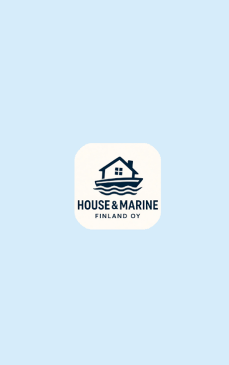
  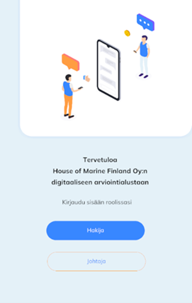
  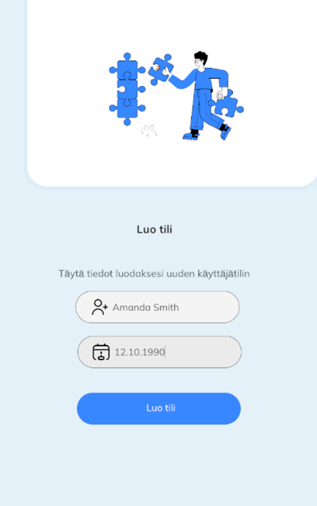
  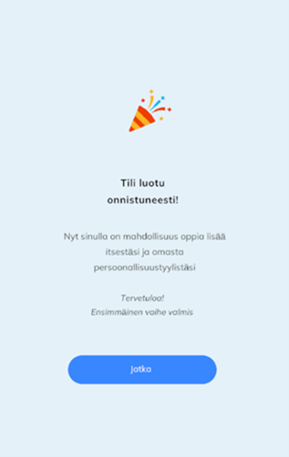
  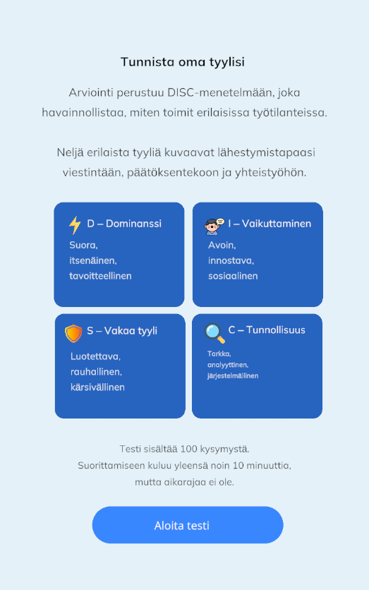
  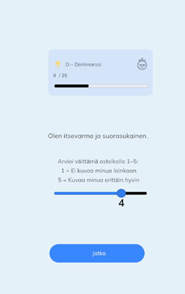
  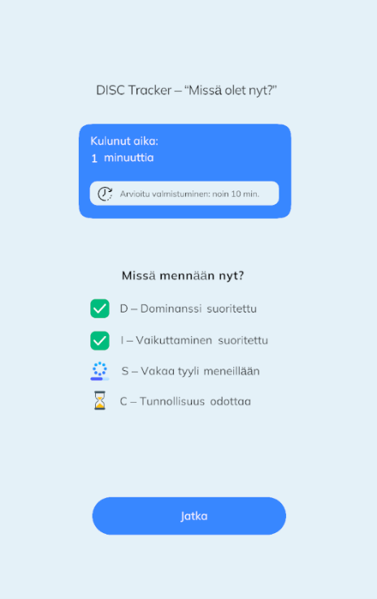
  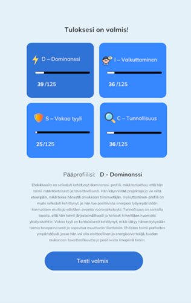
  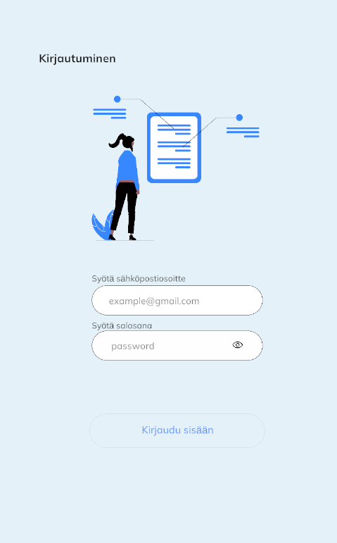
  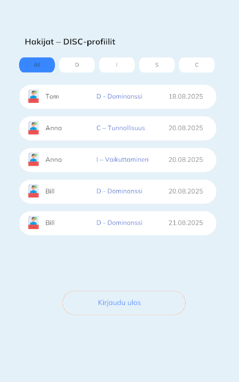
  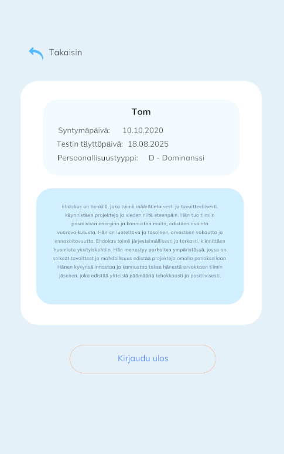
  
</div>

## License

This project was developed as part of a Bachelor’s thesis at LAB University of Applied Sciences.

## Author

- Maria Piili — [Mariia.Piili@student.lab.fi](mailto:Mariia.Piili@student.lab.fi)


Feel free to contact me regarding improvements or collaboration!
